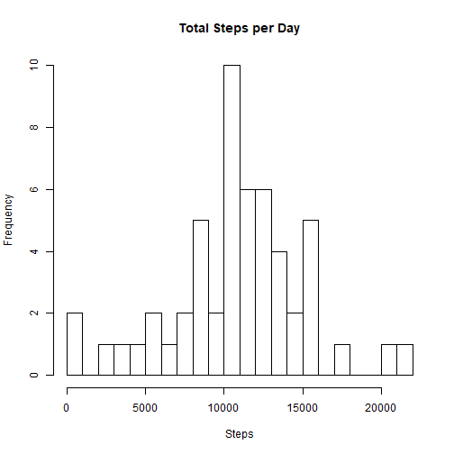
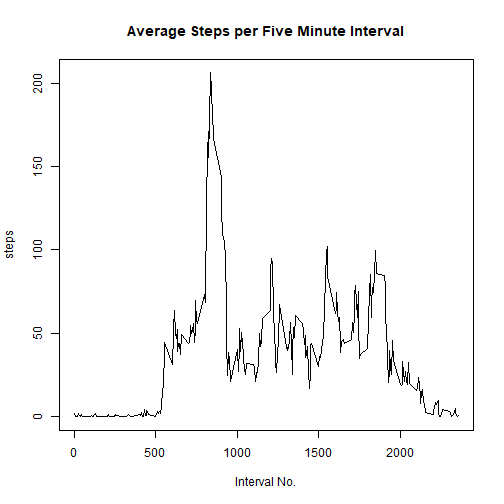
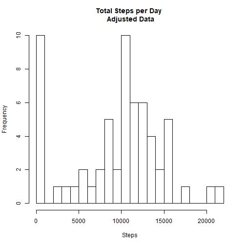
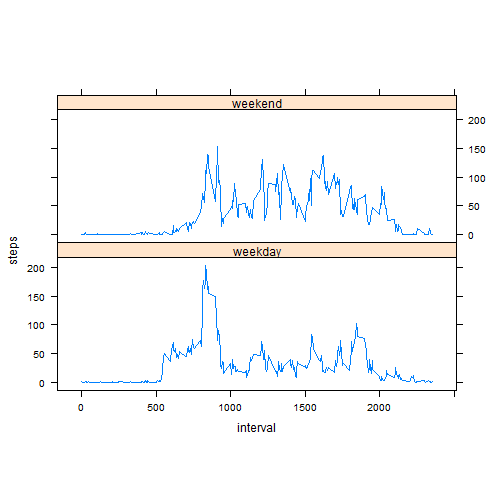

## R Markdown

This is an R Markdown document created for Project 1 for Reproducible Research.

#Loading and preprocessing the data


## Total Steps per day calculation

```r
dataset <- aggregate(steps ~ date, data=inputData, sum, na.rm = TRUE)
hist(dataset$steps, breaks=25, main="Total Steps per Day", xlab="Steps", ylab="Frequency")
```



## Mean of Total number of steps taken per day

```r
stepsMean <- mean(inputData$steps, na.rm=TRUE)
stepsMedian <- median(inputData$steps, na.rm=TRUE)
print(paste("The mean steps per day is: ", stepsMean))
```

```
## [1] "The mean steps per day is:  37.3825995807128"
```

```r
print(paste("The median steps per day is: ", stepsMedian))
```

```
## [1] "The median steps per day is:  0"
```


## Average Daily Activity Pattern

```r
stepsData <- aggregate(steps ~ interval, data=inputData, mean, na.rm=TRUE)
plot(stepsData$interval, stepsData$steps, type="l", main="Average Steps per Five Minute Interval", xlab="Interval No.", ylab="steps")
```



```r
maxSteps <- max(stepsData$steps)
print(paste("The maximum number of steps in a five minute interval was: ", maxSteps))
```

```
## [1] "The maximum number of steps in a five minute interval was:  206.169811320755"
```

## Adding Missing Values to Ananlysis

```r
missingValues <- sum(is.na(inputData$steps))
print(paste("There are", missingValues, "missing data points."))
```

```
## [1] "There are 2304 missing data points."
```

```r
newData <- inputData
newData$steps[is.na(newData$steps)] <- median(inputData$steps, na.rm=TRUE)
newDataAggregate <- aggregate(steps ~ date, data=newData, sum, na.rm=TRUE)
hist(newDataAggregate$steps, breaks=20, main="Total Steps per Day \n Adjusted Data",
     xlab="Steps", ylab="Frequency")
```



```r
newMean <- mean(newData$steps)
newMedian <- median(newData$steps)
print(paste("The mean is: ", newMean))
```

```
## [1] "The mean is:  32.4799635701275"
```

```r
print(paste("The median is: ", newMedian))
```

```
## [1] "The median is:  0"
```

## Differences in activity patterns between weekdays and weekends

```r
newData$date <- as.Date(newData$date)
newData$dayName <- weekdays(newData$date)
newData$weekend <- as.factor(ifelse(newData$dayName == "Saturday" |
                                 newData$dayName == "Sunday", "weekend", "weekday"))
library(lattice)
plotData <- aggregate(steps ~ interval + weekend, newData, mean)
xyplot(steps ~ interval | factor(weekend), data=plotData, aspect=1/3, type="l")
```



